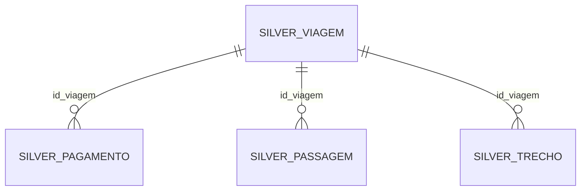

# Fase 2 — Modelagem e regras da Silver

## Entidades e relacionamentos



| Tabela | O que uma linha representa | Chave primária |
| --- | --- | --- |
| `silver.silver_viagem` | Um processo de viagem | `id_viagem`, identificador original |
| `silver.silver_pagamento` | Uma linha de pagamento da fonte | `id_pagamento` |
| `silver.silver_passagem` | Uma linha de passagem da fonte | `id_passagem` |
| `silver.silver_trecho` | Um trecho de uma viagem | `id_trecho`; também UNIQUE (`id_viagem`, `sequencia`) |
| `silver.rejeitados` | Uma linha de origem que não pôde ser aceita | (`origem`, `registro_hash`, `ocorrencia`) |

Pagamentos, passagens e trechos têm FK obrigatória para `silver_viagem.id_viagem`,
com índices de apoio e `ON DELETE RESTRICT`. A PK da viagem preserva o identificador
como texto: ele é um código nominal, assim como PCDP, CPF e códigos de órgãos.
Zeros à esquerda são mantidos.

As fontes dos detalhes não fornecem identificadores únicos de linha. Seus IDs
são SHA-256 do conteúdo original, seguido do número da ocorrência daquele mesmo
conteúdo. Linhas repetidas de pagamentos/passagens são preservadas com IDs distintos;
não há evidência para deduplicá-las como se fossem erros. IDs não dependem de sequências
do banco. Chaves de viagem duplicadas e chaves (`id_viagem`, `sequencia`) ambíguas
em trechos levam todas as linhas envolvidas à rejeição, sem escolher uma arbitrariamente.

## Tipagem e limpeza

- TEXT: remove espaços nas extremidades; vazio e `Sem informação` tornam-se NULL.
- DATE: aceita estritamente `DD/MM/AAAA` ou `AAAA-MM-DD`. Datas impossíveis são rejeitadas.
- TIME: aceita `HH:MM` e `HH:MM:SS`, preservando meia-noite.
- BOOLEAN: converte `Sim` e `Não`, sem inferir outros valores.
- NUMERIC(18,2): conversão pelo tipo Decimal, sem passar por float; ponto de milhar e
  vírgula decimal são tratados explicitamente. Valores negativos monetários são
  preservados, pois não há regra fornecida que autorize descartá-los. Valores
  inválidos ou ausentes obrigatórios não são substituídos por zero.
- INTEGER: sequência de trecho inteira e positiva.
- UFs: nomes brasileiros por extenso e siglas são mapeados às 27 siglas válidas.
  Os nomes originais limpos ficam em `*_uf_nome`. Estados/províncias de países
  estrangeiros são preservados nesse campo, com sigla brasileira NULL.
- Transporte: usa o valor real da fonte. A categoria explícita `Inválido` é rejeitada.
- Datas finais anteriores às iniciais e números de diárias negativos são rejeitados.
- Uma linha filha só é aceita se sua viagem também tiver sido aceita.

Campos opcionais podem permanecer NULL; a ausência de informação não é preenchida
por suposições. Campos obrigatórios estão declarados no layout e no DDL.

## Campos derivados e limites de interpretação

- `duracao_dias = data_fim - data_inicio`: dias decorridos; viagem no mesmo dia tem
  duração zero. Não representa o número de diárias pagas.
- `valor_total_bruto = valor_diarias + valor_passagens + valor_outros_gastos`.
- `valor_total_liquido = valor_total_bruto - valor_devolucao`.

As duas fórmulas financeiras são definições explícitas desta entrega e mantêm os
quatro componentes originais disponíveis. Os valores de pagamentos e passagens
são reconciliados separadamente com suas respectivas fontes. Somar todos esses
arquivos como um único gasto pode contar a mesma despesa mais de uma vez.
A futura Gold deve escolher a fonte e a granularidade de cada métrica.

A Silver mantém a situação da viagem, inclusive `Não realizada`, e não acrescenta
filtro de período ao recorte recebido. A seleção de situações para perguntas de
negócio pertence à etapa analítica.

## Rejeições e reconciliação

`silver.rejeitados` conserva todos os campos originais em JSONB, motivos, identificador
da viagem quando válido e valores numéricos que puderam ser convertidos. É a auditoria
da execução atual e é substituída em cada recarga junto com as tabelas aceitas.
A auditoria não tem FK para viagens: ela precisa registrar também identificadores
órfãos e viagens rejeitadas. Os dados originais da Raw permanecem intactos. Uma linha pode ter vários motivos;
a soma das ocorrências de motivos não equivale necessariamente à quantidade de rejeitados.

Para cada fonte, o processo verifica antes do commit:

1. Quantidade da Raw = aceitos + rejeitados.
2. Soma dos valores convertíveis = soma aceita + soma rejeitada, por campo numérico.
3. Valores não conversíveis e ausentes são contados separadamente.
4. As somas persistidas nas tabelas aceitas e na auditoria coincidem com as calculadas.
5. Hashes de origem, incluindo multiplicidade, cobrem todas as linhas lidas da Raw.

Os conteúdos aceitos também recebem assinaturas no relatório. `--repetir` compara
relatórios e assinaturas das duas cargas; divergência na segunda tentativa provoca
rollback, mantendo a primeira carga. Cada tentativa usa transação REPEATABLE READ,
com TRUNCATE das cinco tabelas Silver, carga em blocos e verificação antes do commit.

O DDL não migra automaticamente estruturas antigas incompatíveis nem executa DROP
ou CASCADE. Use `sql/2_criar_silver.sql` como referência da modelagem vigente.

## Execução

Com a Raw carregada e o PostgreSQL em execução, na raiz do projeto:

```powershell
.\.venv\Scripts\python.exe src/2_transformar.py --repetir
```

O resultado fica em `data/relatorio_silver.json`, com quantidades, motivos de rejeição,
reconciliação por campo, assinaturas e número de cargas confirmadas. O relatório só
é atualizado ao terminar com sucesso. Um relatório antigo não comprova uma tentativa
posterior que falhou.

Testes de integração usam bancos temporários isolados e exigem permissão de criá-los:

```powershell
$env:RUN_RAW_DB_TESTS="1"
$env:RUN_SILVER_DB_TESTS="1"
.\.venv\Scripts\python.exe -m pytest -q tests/
Remove-Item Env:RUN_RAW_DB_TESTS, Env:RUN_SILVER_DB_TESTS
```

## Dicionário: origem → Silver

Os mapeamentos usados pelo código estão em `src/silver_layout.json`. Além dos campos
abaixo, todas as entidades possuem `registro_hash` e `ocorrencia` para rastreabilidade.

### Viagem

| Coluna Raw | Coluna Silver | Tipo | Obrigatória |
| --- | --- | --- | --- |
| `Identificador do processo de viagem` | `id_viagem` | TEXT | Sim |
| `Número da Proposta (PCDP)` | `numero_proposta` | TEXT | Não |
| `Situação` | `situacao` | TEXT | Não |
| `Viagem Urgente` | `viagem_urgente` | BOOLEAN | Sim |
| `Justificativa Urgência Viagem` | `justificativa_urgencia` | TEXT | Não |
| `Código do órgão superior` | `codigo_orgao_superior` | TEXT | Não |
| `Nome do órgão superior` | `nome_orgao_superior` | TEXT | Não |
| `Código órgão solicitante` | `codigo_orgao_solicitante` | TEXT | Não |
| `Nome órgão solicitante` | `nome_orgao_solicitante` | TEXT | Não |
| `CPF viajante` | `cpf_viajante` | TEXT | Não |
| `Nome` | `nome_viajante` | TEXT | Não |
| `Cargo` | `cargo` | TEXT | Não |
| `Função` | `funcao` | TEXT | Não |
| `Descrição Função` | `descricao_funcao` | TEXT | Não |
| `Período - Data de início` | `data_inicio` | DATE | Sim |
| `Período - Data de fim` | `data_fim` | DATE | Sim |
| `Destinos` | `destinos` | TEXT | Não |
| `Motivo` | `motivo` | TEXT | Não |
| `Valor diárias` | `valor_diarias` | NUMERIC(18,2) | Sim |
| `Valor passagens` | `valor_passagens` | NUMERIC(18,2) | Sim |
| `Valor devolução` | `valor_devolucao` | NUMERIC(18,2) | Sim |
| `Valor outros gastos` | `valor_outros_gastos` | NUMERIC(18,2) | Sim |
| Derivada | `duracao_dias` | INTEGER NOT NULL | Sim |
| Derivada | `valor_total_bruto` | NUMERIC(18,2) NOT NULL | Sim |
| Derivada | `valor_total_liquido` | NUMERIC(18,2) NOT NULL | Sim |

### Pagamento

| Coluna Raw | Coluna Silver | Tipo | Obrigatória |
| --- | --- | --- | --- |
| `Identificador do processo de viagem` | `id_viagem` | TEXT | Sim |
| `Número da Proposta (PCDP)` | `numero_proposta` | TEXT | Não |
| `Código do órgão superior` | `codigo_orgao_superior` | TEXT | Não |
| `Nome do órgão superior` | `nome_orgao_superior` | TEXT | Não |
| `Codigo do órgão pagador` | `codigo_orgao_pagador` | TEXT | Não |
| `Nome do órgao pagador` | `nome_orgao_pagador` | TEXT | Não |
| `Código da unidade gestora pagadora` | `codigo_unidade_gestora` | TEXT | Não |
| `Nome da unidade gestora pagadora` | `nome_unidade_gestora` | TEXT | Não |
| `Tipo de pagamento` | `tipo_pagamento` | TEXT | Sim |
| `Valor` | `valor` | NUMERIC(18,2) | Sim |

### Passagem

| Coluna Raw | Coluna Silver | Tipo | Obrigatória |
| --- | --- | --- | --- |
| `Identificador do processo de viagem` | `id_viagem` | TEXT | Sim |
| `Número da Proposta (PCDP)` | `numero_proposta` | TEXT | Não |
| `Meio de transporte` | `meio_transporte` | TEXT | Sim |
| `País - Origem ida` | `origem_ida_pais` | TEXT | Não |
| `UF - Origem ida` | `origem_ida_uf_nome` | TEXT | Não |
| `Cidade - Origem ida` | `origem_ida_cidade` | TEXT | Não |
| `País - Destino ida` | `destino_ida_pais` | TEXT | Não |
| `UF - Destino ida` | `destino_ida_uf_nome` | TEXT | Não |
| `Cidade - Destino ida` | `destino_ida_cidade` | TEXT | Não |
| `País - Origem volta` | `origem_volta_pais` | TEXT | Não |
| `UF - Origem volta` | `origem_volta_uf_nome` | TEXT | Não |
| `Cidade - Origem volta` | `origem_volta_cidade` | TEXT | Não |
| `Pais - Destino volta` | `destino_volta_pais` | TEXT | Não |
| `UF - Destino volta` | `destino_volta_uf_nome` | TEXT | Não |
| `Cidade - Destino volta` | `destino_volta_cidade` | TEXT | Não |
| `Valor da passagem` | `valor_passagem` | NUMERIC(18,2) | Sim |
| `Taxa de serviço` | `taxa_servico` | NUMERIC(18,2) | Sim |
| `Data da emissão/compra` | `data_emissao` | DATE | Não |
| `Hora da emissão/compra` | `hora_emissao` | TIME | Não |
| Derivada | `origem_ida_uf` | VARCHAR(2) | Não |
| Derivada | `destino_ida_uf` | VARCHAR(2) | Não |
| Derivada | `origem_volta_uf` | VARCHAR(2) | Não |
| Derivada | `destino_volta_uf` | VARCHAR(2) | Não |

### Trecho

| Coluna Raw | Coluna Silver | Tipo | Obrigatória |
| --- | --- | --- | --- |
| `Identificador do processo de viagem ` | `id_viagem` | TEXT | Sim |
| `Número da Proposta (PCDP)` | `numero_proposta` | TEXT | Não |
| `Sequência Trecho` | `sequencia` | INTEGER | Sim |
| `Origem - Data` | `origem_data` | DATE | Sim |
| `Origem - País` | `origem_pais` | TEXT | Não |
| `Origem - UF` | `origem_uf_nome` | TEXT | Não |
| `Origem - Cidade` | `origem_cidade` | TEXT | Não |
| `Destino - Data` | `destino_data` | DATE | Sim |
| `Destino - País` | `destino_pais` | TEXT | Não |
| `Destino - UF` | `destino_uf_nome` | TEXT | Não |
| `Destino - Cidade` | `destino_cidade` | TEXT | Não |
| `Meio de transporte` | `meio_transporte` | TEXT | Sim |
| `Número Diárias` | `numero_diarias` | NUMERIC(18,2) | Sim |
| `Missao?` | `missao` | BOOLEAN | Sim |
| Derivada | `origem_uf` | VARCHAR(2) | Não |
| Derivada | `destino_uf` | VARCHAR(2) | Não |
