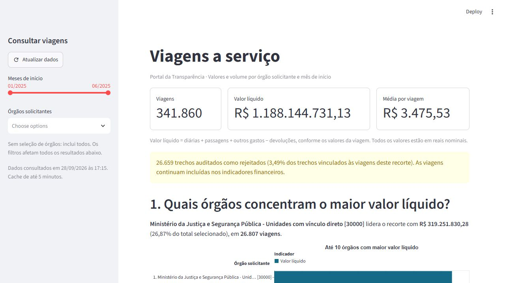
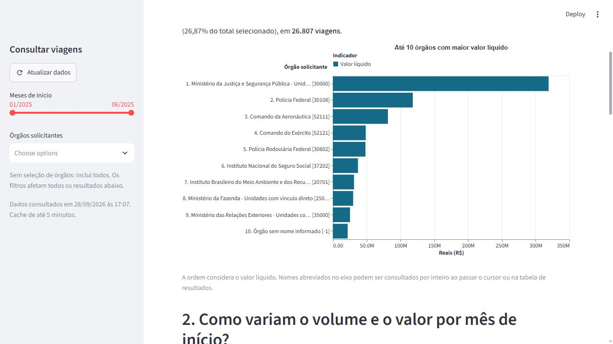
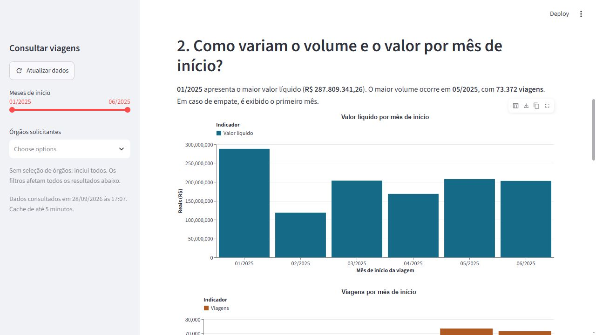
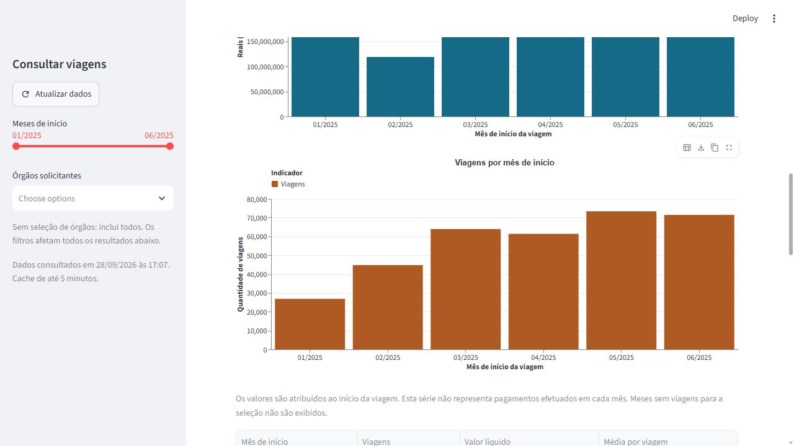
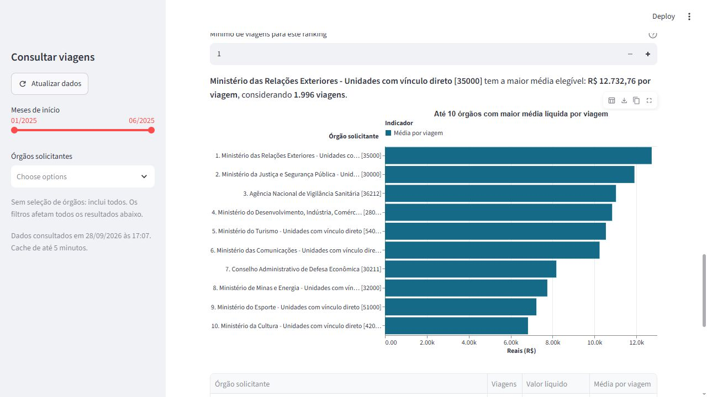
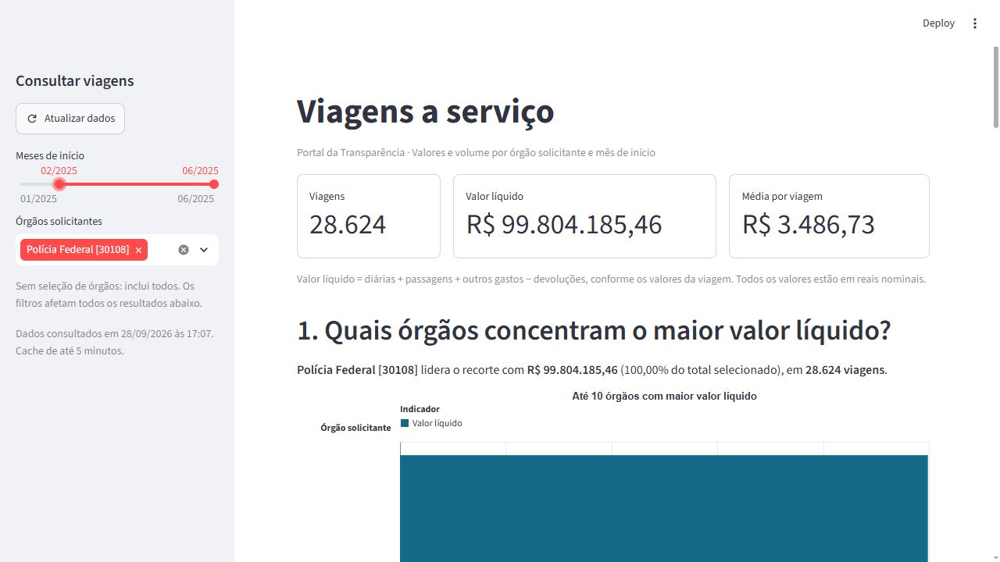

# Validação final e critérios de avaliação

Validação realizada em **28/09/2026**, após a incorporação das PRs das quatro
etapas. A base foi `178900a` (merge da PR #4). Esta revisão acrescenta correções
de instalação, download e apresentação, além das evidências abaixo.

## Correções identificadas na validação real

1. O Drive respondia ao download com uma página de confirmação. A extração agora
   usa [gdown 5.2.0](https://github.com/wkentaro/gdown/tree/v5.2.0) para obter o
   arquivo público, mantendo a verificação TLS e sem usar cookies de login.
   Os quatro CSVs são validados antes de promover o arquivo temporário a ZIP final.
2. `pytest` e `altair` estavam concatenados no `requirements.txt`. A separação
   foi corrigida e a instalação completa foi validada no build Docker.
3. No navegador, o título do eixo dos rankings se sobrepunha aos nomes e parte
   dos rótulos era ocultada. As alturas foram explicitadas, todos os rótulos
   passaram a ser exibidos e o título do eixo ficou acima deles.
4. Este ambiente exige certificados já confiáveis no Windows para acessar o
   PyPI. O Dockerfile aceita um certificado de build opcional por secret,
   sem incorporá-lo à imagem nem desativar a verificação TLS.

## Origem remota comprovada

Arquivo público identificado na subpasta `data` da pasta fornecida pelo curso:
[viagens_2025_6meses.zip](https://drive.google.com/file/d/1R6re1574aCeqNfwJXQ_T7BwHCEsPfgvc/view).

- ID: `1R6re1574aCeqNfwJXQ_T7BwHCEsPfgvc` (incluído no `.env.example`).
- Tamanho baixado: **67.672.166 bytes**.
- SHA-256 remoto e local: `198855840f73e1570869a05a79144e7469f5249b5a1405c535456fee0d6798b0`.
- Os quatro CSVs totalizam **1.879.385 registros** e têm exatamente as mesmas
  contagens e assinaturas do relatório das duas cargas Raw anteriores.

Comando executado com destino separado, inicialmente ausente:

```powershell
$env:DRIVE_FILE_ID="1R6re1574aCeqNfwJXQ_T7BwHCEsPfgvc"
.\.venv\Scripts\python.exe src/1_extrair.py --zip data/validacao_remota/viagens_2025_6meses.zip --validar-apenas --relatorio data/validacao_remota/relatorio.json
```

Nesta rede também foi definido `REQUESTS_CA_BUNDLE` com o caminho do pacote local
de certificados confiáveis. O download e a leitura integral terminaram com código 0.
A comparação de hashes comprova a equivalência com a fonte já carregada; esta
validação remota **não fez uma terceira carga no banco**. O relatório remoto
registra `cargas_verificadas: 0`, pois a idempotência permanece comprovada pelas
[duas cargas Raw](validacao_raw.md).

## Testes e Docker

- **56 testes aprovados em 71,22 segundos**, incluindo os quatro conjuntos de
  integração habilitados. Os três testes novos cobrem download válido, falha
  de conexão e retorno incompleto, com limpeza do arquivo temporário.
- Após os ajustes visuais, os **cinco testes do dashboard** passaram novamente,
  em 14,93 segundos.
- Imagem `pipeline-transparencia-app` construída com sucesso, incluindo instalação
  completa do `requirements.txt` corrigido.
- O painel foi iniciado com Docker Compose na porta **8502**; o PostgreSQL existente
  foi preservado. Essa porta foi usada porque a 8501 estava ocupada.
- A [documentação de execução](dashboard.md) descreve o build com certificado opcional.

## Inspeção no navegador

Inspeção desktop em **1280 × 720**, com o painel servido pelo contêiner:

- Indicadores completos: 341.860 viagens, R$ 1.188.144.731,13 líquidos e média de R$ 3.475,53.
- Os quatro gráficos exibem títulos, eixos, legendas e valores. Os rankings
  mostram os dez rótulos sem sobreposição do título do eixo.
- Polícia Federal, janeiro–junho: 31.694 viagens e R$ 118.269.425,67 líquidos.
- Polícia Federal, fevereiro–junho: 28.624 viagens e R$ 99.804.185,46 líquidos.
- Ao remover os filtros, a visão completa foi restaurada.
- Inspeção mobile não foi realizada.

### Evidências visuais













O [resumo mensal em CSV](evidencias/resumo_mensal.csv) foi exportado da Gold para
conferência dos gráficos. Contém apenas agregados, sem dados de viajantes.
A consulta que o reproduz é a pergunta 2 de `sql/5_perguntas_negocio.sql`.

## Conferência dos oito critérios

| Critério | Situação técnica | Evidência |
| --- | --- | --- |
| 1. Branches e commits | Atendido nas entregas realizadas | Branches `codex/fase1-raw`, `codex/fase2-silver`, `codex/fase3-gold` e `codex/fase4-dashboard`, commits separados e quatro merges na main |
| 2. Organização | Arquivos organizados; aderência ao layout exato do curso depende das instruções completas | SQL em `sql/`, Python em `src/` e `app/`, testes em `tests/`, README e documentação; CSV agregado em `docs/evidencias/`. CSVs de entrada são lidos do ZIP em `data/`, fora do Git |
| 3. Extração e Raw | Atendido com download real, exceções e reexecução comprovados | ZIP remoto idêntico ao local, leitura em blocos, TRUNCATE transacional, duas cargas e testes de falhas |
| 4. Tipagem e limpeza | Implementado e validado | [Modelo Silver](modelagem_silver.md), conversões explícitas, Decimal, datas, booleanos e auditoria de rejeitados |
| 5. Gold com JOIN e GROUP BY | Atendido | `sql/4_carregar_gold.sql`, detalhes agrupados por viagem antes dos LEFT JOINs, 17 totais conciliados |
| 6. Perguntas de negócio | Três perguntas respondidas com dados e interpretação | [Análise Gold](validacao_gold.md) e respostas dinâmicas no painel, com limites de interpretação |
| 7. Dataviz | Quatro gráficos implementados e conferidos no desktop | Capturas acima, títulos, unidades, eixos, legendas, tabelas e tooltips |
| 8. Modelo relacional Silver | PK, FK e constraints explícitas | `sql/2_criar_silver.sql`, testes de integridade e [evidências Silver](validacao_silver.md) |

Esta é uma avaliação técnica das evidências disponíveis, não uma nota oficial.
As instruções completas de organização e eventuais perguntas obrigatórias do curso
não foram fornecidas. Se o avaliador exigir os quatro CSVs originais versionados,
a entrega deve ser ajustada a essa exigência; o CSV agregado não os substitui.
O histórico e as referências não comprovam ausência de plágio por comparação
externa. As bibliotecas utilizadas estão no `requirements.txt`.
